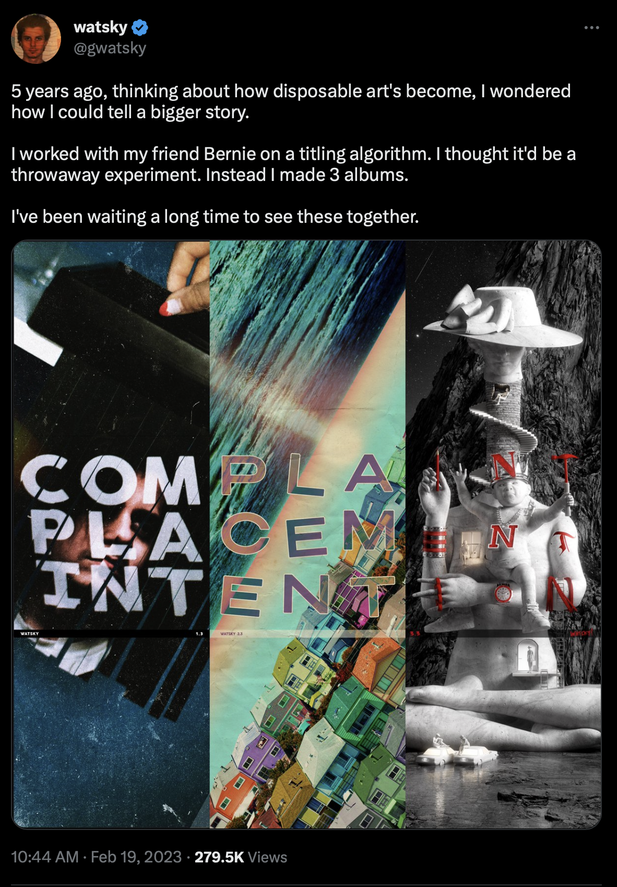

# BBGrams

George Watsky released a trilogy of albums that had a particular pattern to the album names.

1. COMPLAINT
2. PLACEMENT
3. INTENTION

It was revealed after the release of INTENTION, that the album artwork of all the albums spelled out the titles horizontally across the albums as well. This wordplay appears to be the result of a search by (data scientist?) Bernie Beckerman. Hence, I have decided to refer to these word triples as "bbgrams", after Bernie Beckerman.

See here: [INTENTION was created by Watsky and The Mystery League, with help from Bernie Beckerman, web design by MONK](https://xxx.kisswatskysgluteusmaximus.xxx)

And here: [I worked with my friend Bernie on a titling algorithm. I thought it'd be a throwaway experiment. Instead I made 3 albums.](https://twitter.com/gwatsky/status/1627363406889238529?s=20)

This repo contains code that will attempt to check for other triples of 9-letter words that do the same, beautiful, thing.

## My Personal Favorite Result

	NEW SPA PER
	SPA CET IME
	PER IME TER

I like to think that this one juuuuuussst barely didn't make the cut, lol. :D
